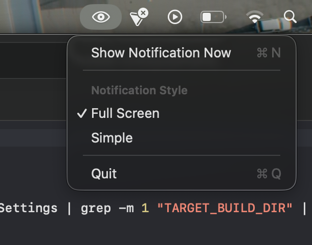
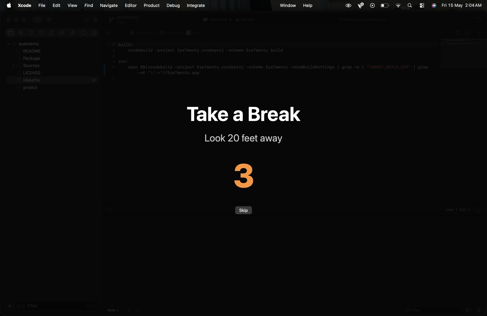

# EyeTwenty

A macOS menu bar widget that helps you follow the 20-20-20 rule to prevent eye strain.

The 20-20-20 rule: Every 20 minutes, look at something 20 feet away for 20 seconds.

<p align="center">
  
</p>

## Features

- **Menu Bar Integration:** Sits quietly in your menu bar.
- **Two Notification Styles:**
  - **Full Screen:** A tasteful overlay that covers your screen and counts down the 20 seconds.
    <br>
    
  - **Simple:** A standard macOS notification reminding you to take a break.
- **Smart Detection:** Automatically pauses notifications when you are sharing your screen (e.g., during a Zoom or Teams meeting), so you aren't interrupted while presenting.

## Requirements

- macOS 12.0+

## Building and Running

This project uses [XcodeGen](https://github.com/yonaskolb/XcodeGen) to manage the Xcode project file.

1.  Make sure you have `xcodegen` installed (e.g., `brew install xcodegen`).
2.  Generate the Xcode project:
    ```bash
    xcodegen generate
    ```
3.  Open `EyeTwenty.xcodeproj` in Xcode and hit Run, or use the provided `Makefile`:
    ```bash
    make build
    make run
    ```

## Usage

- The app will run in your menu bar (look for the "eye" icon).
- Click the icon to access settings, quit the app, or manually trigger a notification.
- In Settings, you can switch between the Full Screen and Simple notification styles.